# Virtual Machine Setup Lab
### Summary
During training, security professionals create labs to practice their skills. These virtual lab environments provide a safe place to run real world attacks without causing damage to actual systems. That being said, always be diligent in your security tests and make sure not to attack systems you don’t have permission to.

In this lab we will be creating a network of 3 machines: Kali linux, windows 10, and metasploitable2. The machines will reside on the same network and be able to communicate with each other as well as with the internet. To set up our virtual lab environment we will need to install VirtualBox which will run and network the 3 machines.

***

## Oracle VirtualBox Setup
### Overview
VirtualBox is a virtualization software and is free download and use for non-commercial purposes. It does require virtualization to be enabled on your system. You can enable your system’s virtualization settings with these links:

* Windows: https://www.minitool.com/news/enable-virtualization-windows-10.html
* Mac: https://apple.stackexchange.com/questions/394967/how-do-i-enable-intel-virtualization-in-a-macbook-pro

Once virtualization is enabled, you can begin installing Oracle VirtualBox.

### Steps
1. Start by downloading the VirtualBox installer and Extension Pack for your system. You can download from here https://www.virtualbox.org/wiki/Downloads
2. Once downloaded, install VirtualBox with the default settings.
3. After installation, double click on the Extension Pack plugin to begin installation process with default settings.
4. Once VirtualBox is set up you can create a private network on your system. All your machines will run on this network and they will have access to the internet. Start by navigating to the Network Setting for VirtualBox. Tools->Preferences->Network->Add New NAT Network->Edit Selected NAT Network

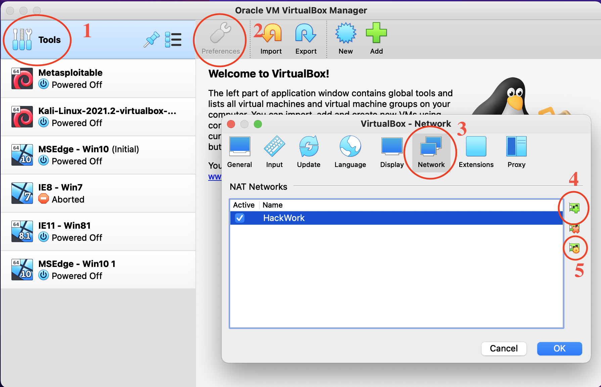

5. The default settings are fine for our setup and you can click ok. (If you feel like naming your network you can, this won't affect how your network will perform)

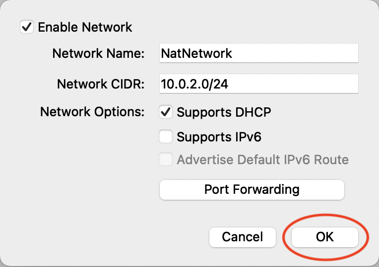

***

## Kali VM Setup
### Overview
Kali Linux is a system designed for security testers. It is based on Debian Linux and it has many security tools preinstalled. It is regularly updated and has many different installation options available to it.

### Steps
1. Start with downloading the Kali VirtualBox ova file. You can download it from here https://www.kali.org/get-kali/#kali-virtual-machines
2. You will need to decompress the file from its 7zip format. This can be done with a 7zip decompressor. If you don’t have one already installed, you can download one form here https://www.7-zip.org/download.html
3. Once decompressed you should be left with a folder with three files in it. Open the Ovf file. This should open an import screen in VirtualBox. Most of the settings should be fine, however, you may want to up the RAM from 2048MB to 4096MB. Once Done, you can import. After the import is complete you should be all set with the Kali Machine. Simply double click on the machine to start it. Default Credentials are
    * Username: kali
    * Password: kali

Import RAM  |  Kali Login
:----------:|:------------:
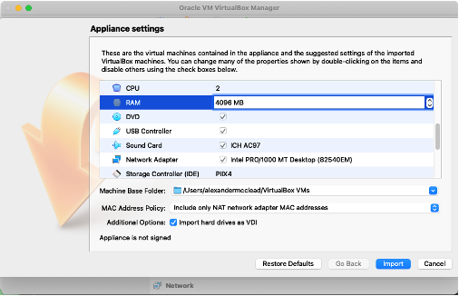 | 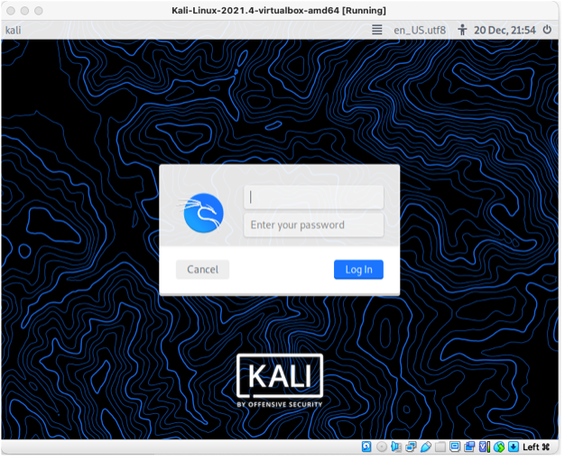

4. Once your Kali Machine is set up we can add it to our VirtualBox Network. Shutdown Kali and navigate to it's network settings. Kali->Settings->Network Once there you can change the "Attached to" to "NAT Network" and "Name" to the name of the network we made in the VirtualBox Setup step 4 and click "OK".

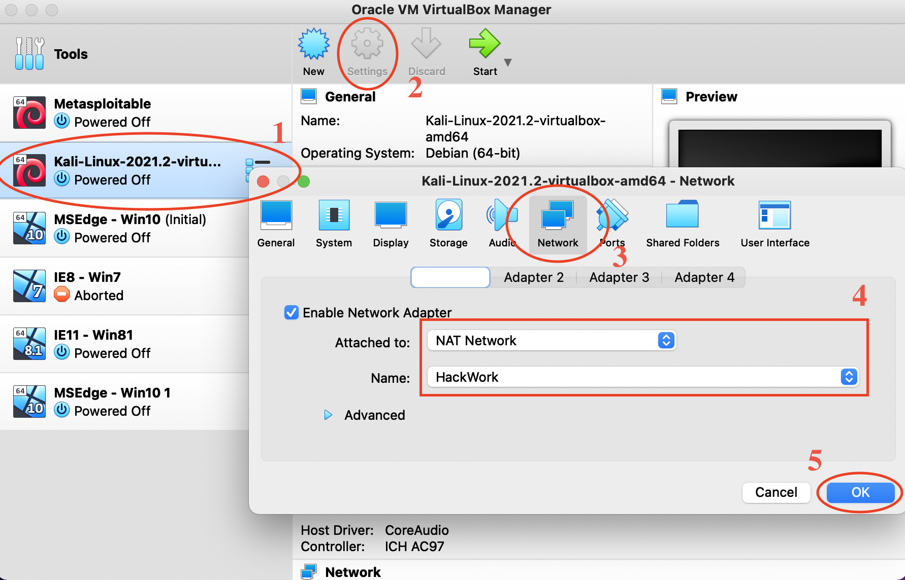

***

## Windows VM Setup
### Overview
Given the popularly of Window’s systems, security experts need to be familiar with their defenses and vulnerabilities. Windows vms have a built in timer till they stop working: 90days from download.

### Steps
1. Start with downloading the Windows Virtual Machine file. You can download it from here: https://developer.microsoft.com/en-us/microsoft-edge/tools/vms/ One the zip file is done downloading unzip it.
2. Once unzipped, simply double click on the Ovf file. This will open the VirtualBox import screen. You may want to up the RAM for this import from 4096MB to 8192MB or 16384MB depending on what you have available. Once set, you can import and when done, launch by double click the new machine. Default Credentials are
    * Username: Admin
    * Password: Passw0rd!

3. To add Windows to our NAT Network we just need to repeat step 4 in the [Kali VM Setup](#KaliNetwork) for our new Windows Machine.

***

## Metasploitable2 VM Setup
### Overview
Metasploitable2 is a purposely vulnerable system with many vulnerabilities set up in it. This system should never be used in on an unsecured network. No personal files should be kept on this system either.

### Steps
1. You can download Metasploitable2 from: https://sourceforge.net/projects/metasploitable/ Once downloaded, unzip the file.
2. In VirtualBox click new. You can fill in the fields below and click Continue.

New VM   |  Name Fields
:-------:|:------------:
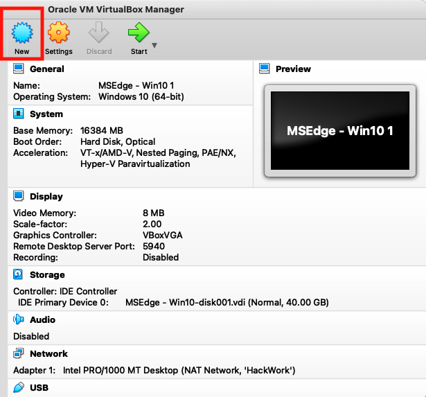 | 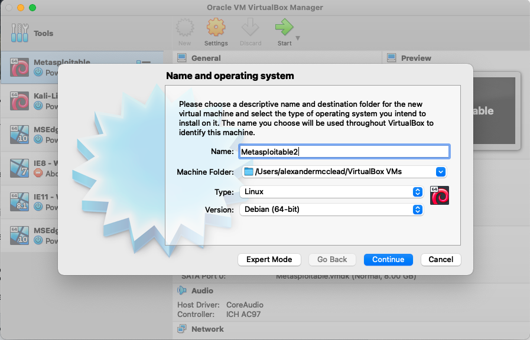

3. 1024MG for RAM is plenty, click continue

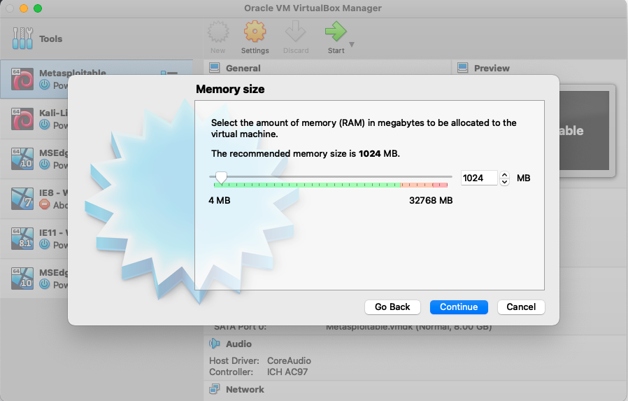

4. In the Hard Disk menu, click “Use an existing virtual hard disk file”. Select the folder option and then Add. Navigate to the expanded folder with the Metasploitable2 files select the vmdk file.

Hard Disk p1 | Hard Disk p2
:-----------:|:-------------:
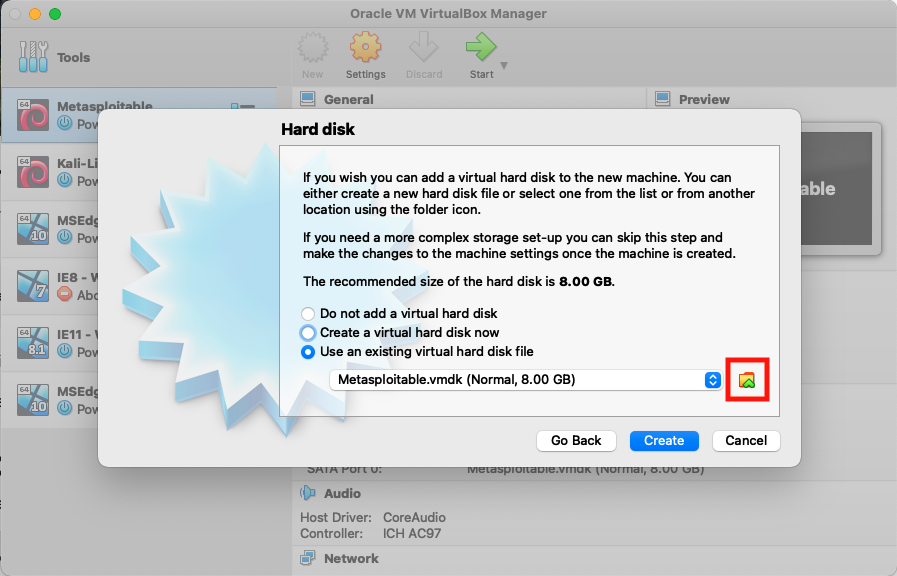 | 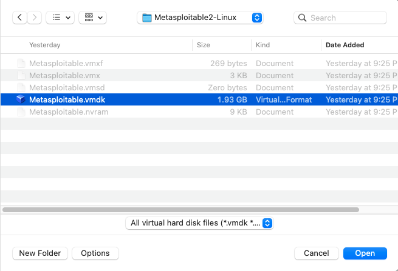

5. Double click on the newly created machine. Default Credentials are:
    * Username: msfadmin
    * Password: msfadmin

6. To add Metasploitable2 to our NAT Network we just need to repeat step 4 in the [Kali VM Setup](#KaliNetwork) for our new Metasploitable2 Machine.

***

## Creating snapshots:
### Overview
Now that we have all our machines made and setup for how we're going to use them, it would be prudent to "save our work" so to speak. Creating a snapshot saves the current state of the machine the snapshot is made from. This means that if our machine crash, fails, or develops an error we can't fix, you can roll back to a working version of the machine.

### Steps

1. First make sure your Machine is shutdown then click on the machine you want to make the snapshot of. You'll see a menu icon appear next to it. Click on the menu that appears and select Snapshots and then click Take

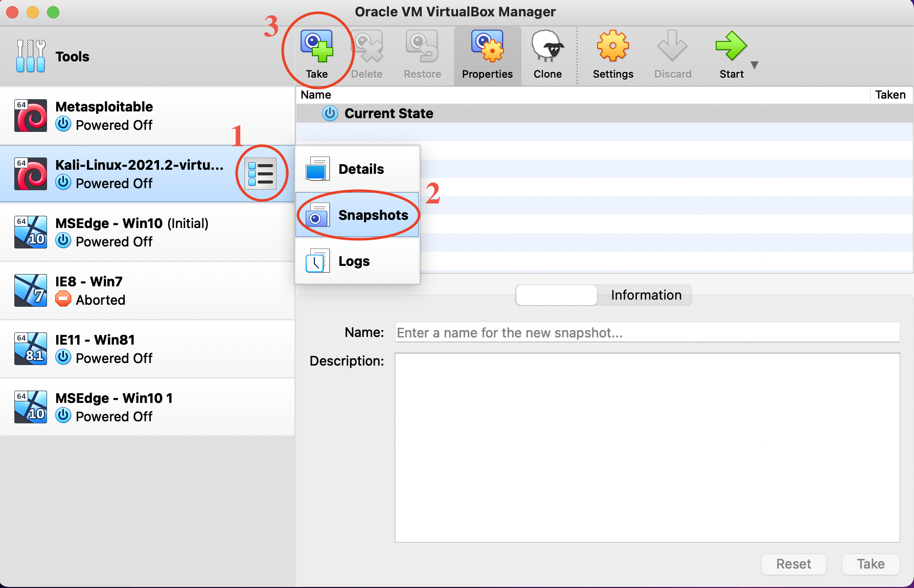

2. You'll see a text field with a description field. You can fill these in with "Fresh Setup" or something to that effect. It is good habit to name your snapshots so you know what they are for in the future.

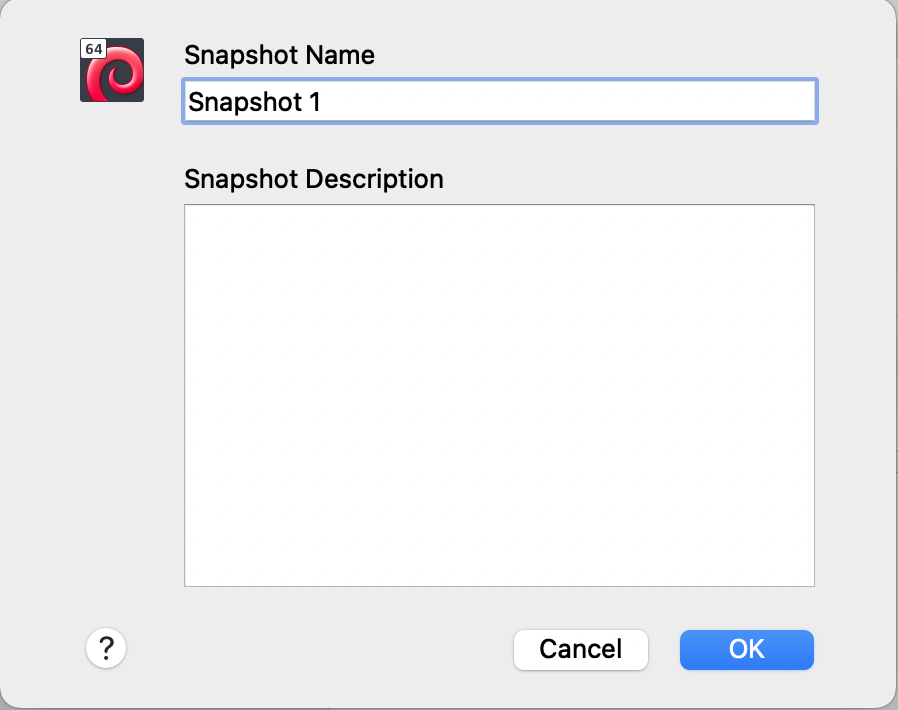

3. Repeat steps 1 and 2 for each of the machines in this lab.

***

## Summary
We now have the following machines setup and all on the same network:

1. Kali
2. Windows 10
3. Metasploitable2

You also now have a snapshot of each machine in it's fresh state. If anything happens in the future and one crashes, you can reload it to this working state.
