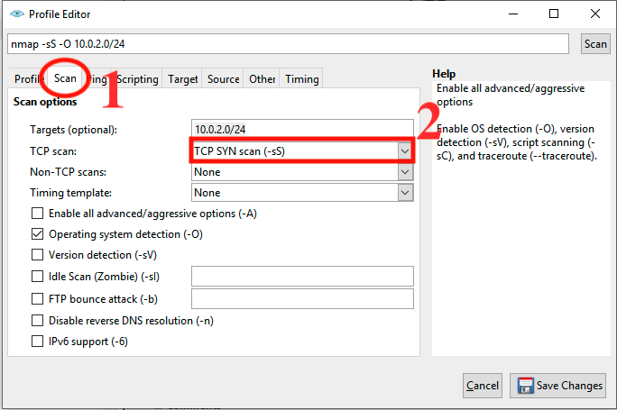

# Nmap Lab
## Scenario
You are a New Network Admin and you need to check what ports are open on one of your systems. You know that it’s a Linux Machine and you know which network it’s on but you’re not sure of its IP address.

## Objectives
1. Find the machine we're looking for.
2. Scan for open ports on the target machine.
3. Identify services running on open ports.

## Environment
* Windows 10 VM
* Metasploitable 2
* Machines are on the same network

## Estimated Duration
30-45 Minutes

## Part 1: Device Detection and OS Scanning
1. Nmap is normally run in the command line, however, for new network admins and ethical hackers, Nmap also provides a graphical user interface (GUI) to work with called Zenmap. Sadly, Nmap is no longer supporting Zenmap Debian/kali installations. For Zenmap demos, we'll install it on Windows 10 running as administrator. You can download the exe for install [here](https://nmap.org/download.html).  

2. Before we begin, we want to clear everything from the command box except for “nmap”. When we first join a network, we want to see who else is out there. We can do this by clicking in the Target Field and typing our network id “10.0.2.0/24” and pressing “Scan”  

3. According to Nmap there are five hosts on my network. Currently, we have very little information on each of the addresses returned. We know which one is ours but what about the others? If we look in the host details tab all we see is the statistics on what we have scanned. NOTE: It is possible that devices may not respond to Nmap’s initial ping and therefore will not get listed here by Nmap.  

4. We can use Nmap to determine (or give us a best guess) what operating systems are on the network. To do this we can go to Profile->New Profile and here we’ll give our new profile a name. I have called it “OS Scan”. From there we can go to Scan and select the option Operating System Detection (-O) and click “Save Changes”

OS Scan p1  |  OS Scan p2
:----------:|:------------:
 | 

5. Once you have the profile saved you can then select it and run it in the profile section.  

6. After running the scan we can see that we’re working with a Linux 2.6.9-2.6.33 computer at address 10.0.2.7  

7. Continuing forward we will focus on the 10.0.2.7 metasploitable2 machine so we can change our target field to that address. This will increase the speed of our scans and reduce the noise (excess traffic) we produce while scanning.

## Part 2: Port Scanning
1. Now that we have identified our target, we can proceed to scan it and discover what ports it has open and what services it has running. Select Profile->New Profile, I named mine “Full Port Scan”, and go to Scans. For this example, I selected TCP Scans-> SYN Scan (-sS). You will only be able to run this scan if you are running Nmap as root. If you are not able to run Nmap as root you can choose Connect Scan (-sT). We will also select Target->ports and enter the range 1-65535 and click Save Changes

Full Scan p1  |  Full Scan p2
:----------:|:------------:
 | 

2. With this new scan we can see that more ports are open, including a couple of SQL ports. We can dive deeper into these ports by telling Nmap to try and detect the versions in use. You can go to Profile->Edit Selected Profile->Version Detection to enable the Version detection setting in the Nmap scanner. After the scan finishes, we can see more detailed information in the Ports/Hosts tab. 

3. From here we can check to see if any of the versions of services we’re running are vulnerable to attack through online references. Port 21 is running an old version of vsftpd 2.3.4 which has an known exploit. We can use a script to test whether the system is vulnerable to an attack. Create a new profile, I named mine “vsftpd 2.3.4 exploit”, and go to the scripts tab. Check the box for ftp-vsftpd-backdoor and set the port to 21. After running the command we can see that the system is vulnerable. If we’re an attacker, we can continue to exploit the vulnerability or, if we’re an admin, we can upgrade the service and protect the system.

## Part 3: Defending Against Scanning
Some of the best ways to defend against Nmap scanning are:
1. Having an intrusion detection system monitoring the network for abnormal traffic and classic signs of scanning.
2. Performing routine port scans to check what ports are open and close them if they don't need to be open.
3. Keeping your services updated so that they don't have easy vulns to exploit.

## Part 4: Extra Notes
1. Timing Templates: Depending on the conditions of your scan you may need to scan more quickly than Nmap does by default. You can use the timing templates to increase the speed of your scans. Conversely, if you want to stay under the radar you can slow the speed of your scan. Paranoid (-T0) is the slowest, Insane (-T5) is the fastest, and Normal (-T3) is the default speed.
2. Scan Statuses: In the Lab, we worked with a system that we had direct access to and had no firewall in place, because of this all the ports we scanned were either open or closed. In a real situation, a firewall could exist between you and the target system. If one does, ports may show as filtered, stating that the firewall stopped them. Sometimes Nmap doesn’t know conclusively whether a port is open or filtered and the status may be open|filtered. Finally, there is the unfiltered status which means that the port is responding in an unexpected way to Nmap's scans.
3. Scan Types: There are many different types of scans that Nmap can perform such as SYN Scan, Connect Scan, ACK Scan, FIN Scan, NULL Scan, Xmas Scan, etc. Each of these scans has its uses. FIN scans can sometimes make it through a firewall where SYN Scans will get blocked, depending on the firewall. Sometimes NULL or Xmas Scans will produce unexpected results from systems as they don’t know how to respond to them. There are even non-TCP Scans such as UDP Scans to pick up open UDP ports.

## Challenge
* Scan your Optional 3rd system with a Xmas Scan at the Aggressive Time Template and try to determine what Operating System it’s running.
* Try some of the NSE scripts that come with Nmap. Especially the ftp-vsftpd-backdoor NSE script.

## Conclusion
It is important to note that Nmap has a vast collection of resources for many different purposes and it would be impossible to cover them all in just one lab. With a working understanding of how the Nmap GUI works you should now be able to put together your scans and understand the result. You should feel free to experiment with different types of scans on your own devices and see what the results are.
